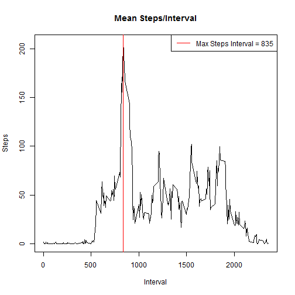
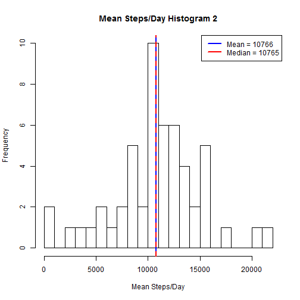
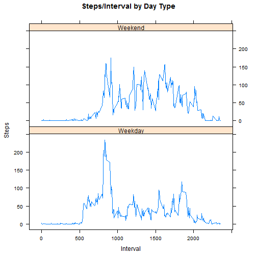

##Load Packages
First of all, my script uses some packages, so we must install and load
them if necessary.


```r
if("knitr" %in% rownames(installed.packages()) == FALSE) 
{install.packages("knitr")}
library(knitr)
if("dplyr" %in% rownames(installed.packages()) == FALSE) 
{install.packages("dplyr")}
library(dplyr)
if("lattice" %in% rownames(installed.packages()) == FALSE) 
{install.packages("lattice")}
library(lattice)
```


## Loading and preprocessing the data

```r
act <- read.csv("activity.csv")
```

```
## Warning in file(file, "rt"): cannot open file 'activity.csv': No such file
## or directory
```

```
## Error in file(file, "rt"): cannot open the connection
```

```r
act <- tbl_df(act)
```


## What is mean total number of steps taken per day?
I use the dplyr package to create a data table of total steps per day. I also save, 
as objects, the mean and median.


```r
meansteps <- act %>% group_by(date) %>% select(date, steps) %>% summarise_each(funs(sum))
mean <- as.integer(mean(meansteps$steps, na.rm = T))
med <- as.integer(median(meansteps$steps, na.rm = T))
```

The plot:

```r
png(file = "plot1.png", width = 480, height = 480)
hist(meansteps$steps, breaks = 20, main = "Mean Steps/Day Histogram", 
     xlab = "Mean Steps/Day", ylab = "Frequency")
abline(v = mean, col = "blue", lwd = 2)
abline(v = med, col = "red", lwd = 2, lty = 2)
legend("topright", legend = paste(c("Mean", "Median"), c(mean, med), 
                                  sep = " = "), col=c("blue", "red"), lwd=2)
dev.off()
```

 

```
## RStudioGD 
##         2
```


## What is the average daily activity pattern?
I create a data table with the mean steps for each interval across all days.


```r
intmeans <- act %>% group_by(interval) %>% select(interval, steps) %>% 
     summarise_each(funs(mean(., na.rm = T)))
```

The plot:

```r
png(file = "plot2.png", width = 480, height = 480)
plot(intmeans$interval, intmeans$steps, type = "l", main = "Mean Steps/Interval", 
     xlab = "Interval", ylab = "Steps")
abline(v = intmeans[which(intmeans$steps == max(intmeans$steps, na.rm = T)),1],
       col = "red", lwd = 1)
legend("topright", col = "red", lwd = 1, legend = paste("Max Steps Interval", 
          intmeans[which(intmeans$steps == max(intmeans$steps, na.rm = T)),1], sep = " = "))
dev.off()
```

 

```
## RStudioGD 
##         2
```

Interval 835 achieved the highest average number of steps. Congratulations, 835!


## Imputing missing values
For all NA values in the orginal data, I inserted the average number of steps for that interval.


```r
actfilled <- tbl_df(actfilled)
meanstepsfilled <- actfilled %>% group_by(date) %>% select(date, steps) %>% summarise_each(funs(sum))
mean <- as.integer(mean(meanstepsfilled$steps, na.rm = T))
med <- as.integer(median(meanstepsfilled$steps, na.rm = T))
```

We see from the following plot that this does not change the mean and only slightly changes
the median.


```r
png(file = "plot3.png", width = 480, height = 480)
hist(meanstepsfilled$steps, breaks = 20, main = "Mean Steps/Day Histogram 2", 
     xlab = "Mean Steps/Day", ylab = "Frequency")
abline(v = mean, col = "blue", lwd = 2)
abline(v = med, col = "red", lwd = 2, lty = 2)
legend("topright", legend = paste(c("Mean", "Median"), c(mean, med), 
                                  sep = " = "), col=c("blue", "red"), lwd=2)
dev.off()
```

 

```
## RStudioGD 
##         2
```

Of course the total daily number of steps did increase by 86,129.5.


```r
diff <- sum(meanstepsfilled$steps, na.rm = T) - sum(meansteps$steps, na.rm = T)
```

## Are there differences in activity patterns between weekdays and weekends?
To explore this question, we must first properly categorize each date as a "Weekday" or
"Weekend". Then we create a data table for the mean number of steps for each interval
grouped by the type of day.


```r
actdays <- as.data.frame(act)
actdays$date <- as.POSIXlt(actdays$date)
actdays$day <- weekdays(actdays$date)
actdays[,"type"] <- NA
for(i in 1:nrow(actdays)){
     if(actdays[i,4] == "Saturday"| actdays[i,4] == "Sunday"){
        actdays[i,5] <- "Weekend"
     }else{
          actdays[i,5] <- "Weekday"
     }
     }
actdays$date <- as.character(actdays$date)
actdays <- tbl_df(actdays)
wkend <- actdays %>% group_by(interval, type) %>% select(interval,type,steps) %>% 
     summarise_each(funs(mean(.,na.rm = T)))
```

The plot shows us that the mean number of steps on a weekend is lower before about
interval 900, but is generally higher for the rest of the day. 


```r
png(file = "plot4.png", width = 480, height = 480)
densityplot(~interval|type, data = wkend)
xyplot(steps~interval|type, ylab="Steps", xlab="Interval", 
 main="Steps/Interval by Day Type", layout=(c(1,2)), type = "l", data = wkend)
dev.off()
```

 

```
## RStudioGD 
##         2
```

